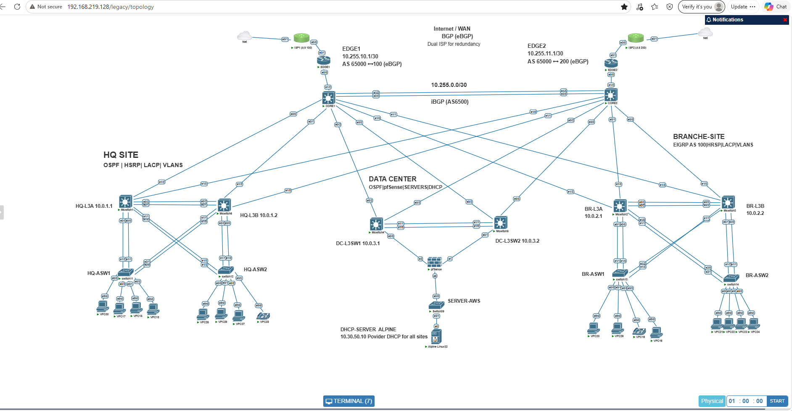
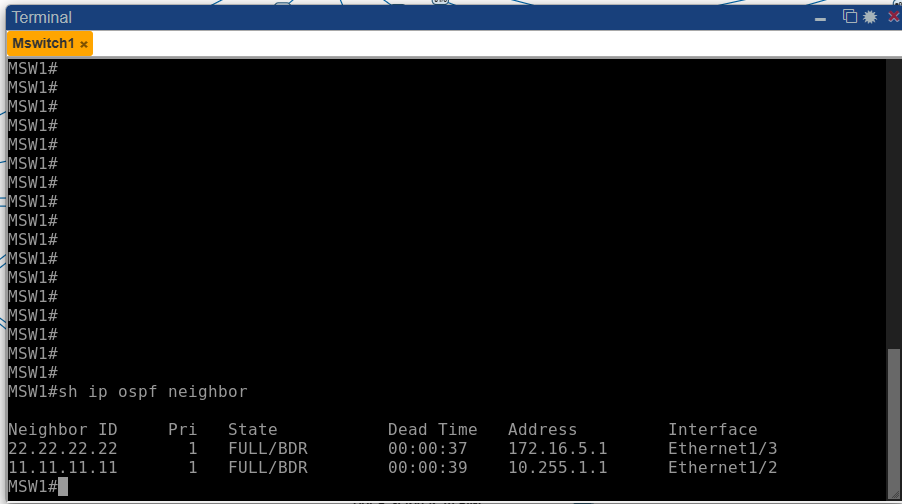
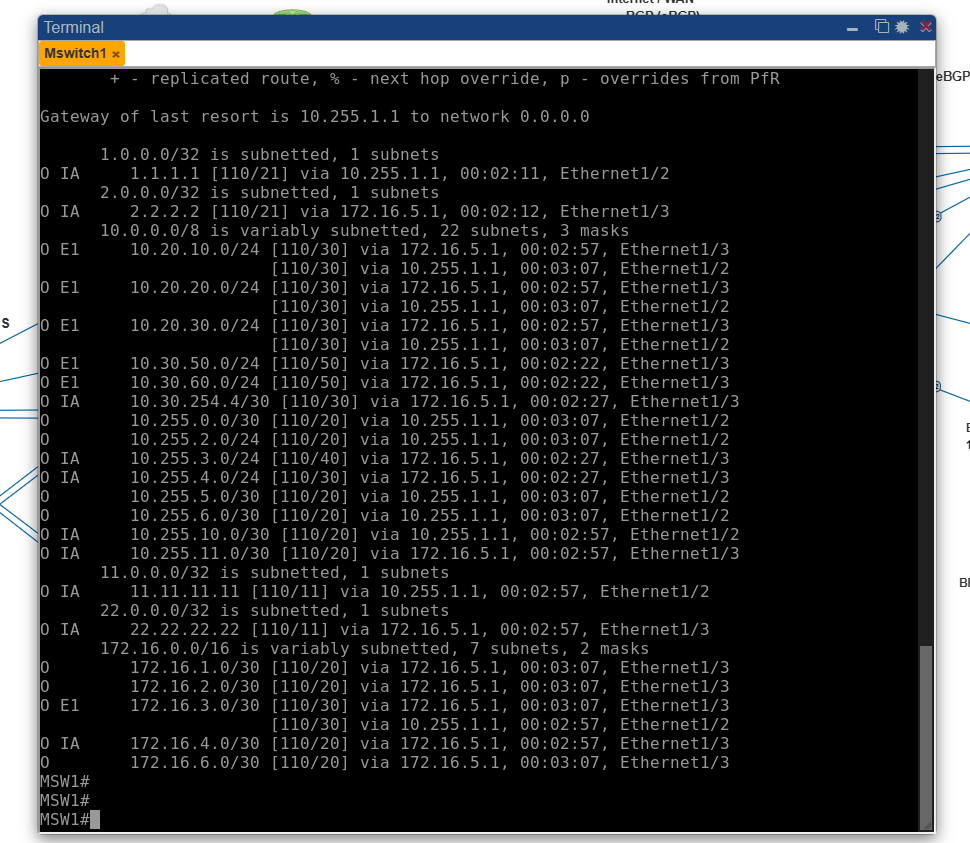
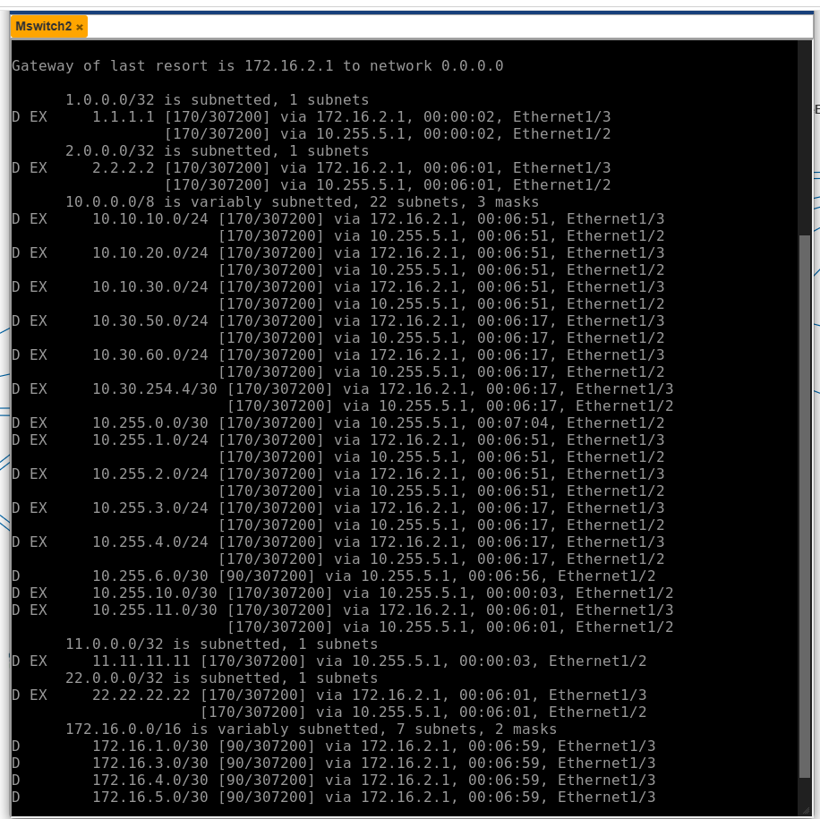
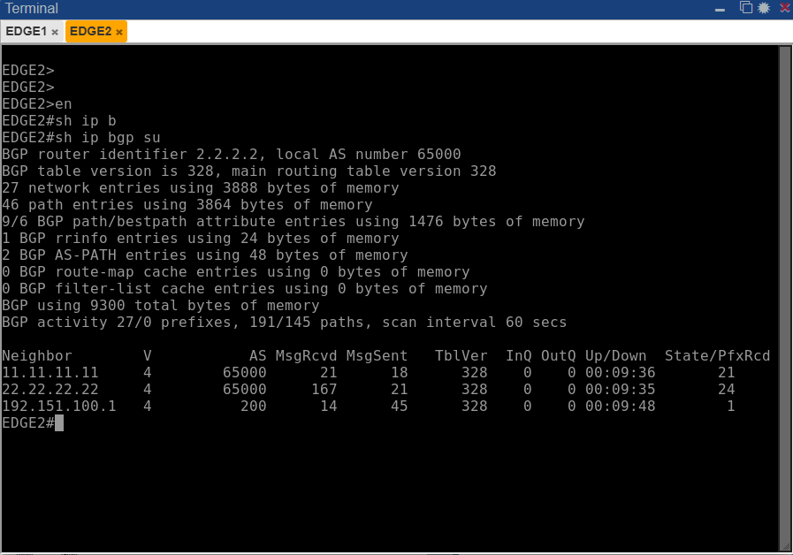
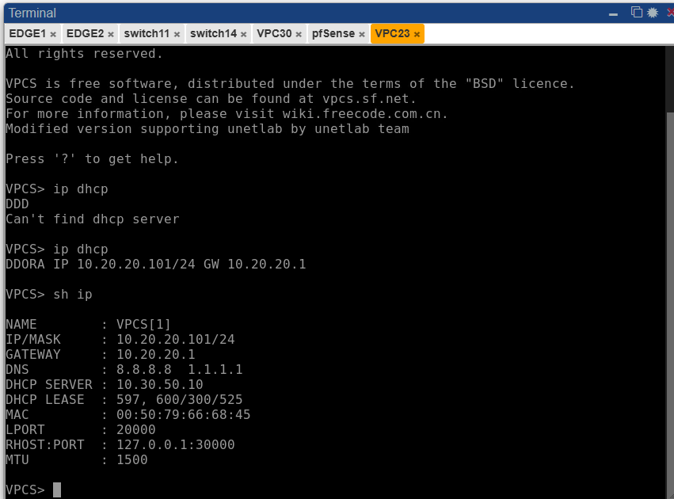
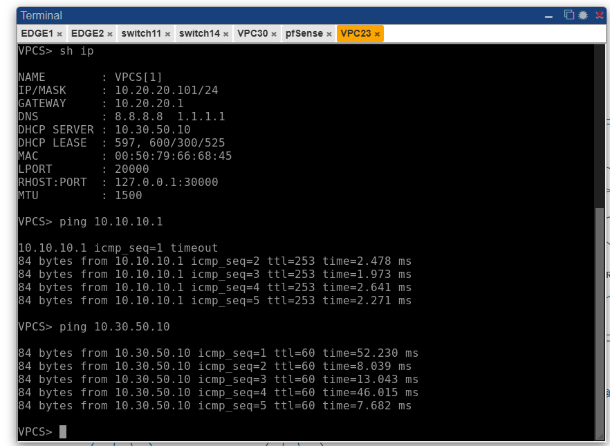

# Enterprise Network Lab – PNETLab

## Project Overview

I built this multi-site enterprise network lab in **PNETLab** to practice routing, switching, redundancy, centralized network services, and troubleshooting in a larger environment than a basic CCNA lab.

The environment includes **Headquarters (HQ), Branch, and Data Center** sites connected through redundant Core and Edge devices. I used multiple routing protocols and tested failure scenarios to verify that traffic could continue using alternate paths.

> **Main technologies:** OSPF, EIGRP, BGP, HSRP, EtherChannel/LACP, STP, VLANs, centralized DHCP, pfSense, and redundant Internet connectivity.

## Network Topology



### High-Level Design

- **Dual ISP / Edge:** EDGE1 and EDGE2 provide external connectivity through two simulated ISPs.
- **Core:** CORE1 and CORE2 provide redundant backbone connectivity.
- **HQ:** Redundant Layer 3 switches, HSRP gateways, access switches, VLANs, and OSPF.
- **Branch:** Redundant Layer 3 switches, HSRP gateways, access switches, VLANs, and EIGRP AS 100.
- **Data Center:** Redundant Layer 3 connectivity, pfSense, server network, and centralized DHCP.

## Addressing Summary

| Area | Addressing |
|---|---|
| HQ VLANs | `10.10.x.0/24` |
| Branch VLANs | `10.20.x.0/24` |
| Data Center Servers | `10.30.50.0/24` |
| DMZ | `10.30.60.0/24` |
| Infrastructure / Transit | `10.255.x.x` and `172.16.x.x` |
| Central DHCP Server | `10.30.50.10` |

## Routing

### OSPF

OSPF is used in the HQ/Data Center side of the network. The HQ multilayer switch forms adjacencies toward both Core paths.



The routing table also demonstrates multiple learned paths to remote enterprise networks.



### EIGRP

The Branch uses **EIGRP AS 100**. The Branch routing table contains internal and redistributed EIGRP routes and redundant next hops toward the Core.



### BGP

BGP is used at the Internet Edge. The enterprise uses **AS 65000**, with external BGP connectivity to the simulated ISPs.

The EDGE2 verification below shows internal AS 65000 peers and the external ISP2 peer in **AS 200**.



## Gateway and Layer 2 Redundancy

### HSRP

HSRP provides redundant default gateways for user VLANs. I also distributed active gateway roles between the multilayer switches rather than making one switch active for every VLAN.

Example Branch virtual gateways:

- VLAN 10: `10.20.10.1`
- VLAN 20: `10.20.20.1`
- VLAN 30: `10.20.30.1`

I tested HSRP by shutting an active SVI and verified that the standby switch transitioned to the **Active** state.

### EtherChannel and STP

I used **LACP EtherChannel** for redundant access/distribution links and verified STP roles and forwarding states. During failure testing, I shut one physical EtherChannel member and confirmed that the port-channel remained operational through the remaining link.

## Centralized DHCP

Instead of configuring a separate DHCP service at every site, I configured an **Alpine Linux DHCP server** in the Data Center:

- DHCP server: `10.30.50.10`
- Server gateway: `10.30.50.1`
- DNS: `8.8.8.8` and `1.1.1.1`

Remote Layer 3 VLAN interfaces use `ip helper-address 10.30.50.10` to relay DHCP requests to the centralized server.

This Branch client received `10.20.20.101/24` from the Data Center DHCP server:



## End-to-End Connectivity

I verified communication between the different sites after routing and DHCP were completed.

The screenshot below shows a Branch client reaching the HQ network and the Data Center DHCP server.



## Redundancy Testing

I did not only verify the network while every link was operational. I intentionally introduced failures to test the design.

| Test | Failure Introduced | Result |
|---|---|---|
| HSRP | Shut active VLAN SVI | Standby switch became Active |
| EtherChannel | Shut one LACP member | Port-channel remained operational |
| EIGRP/Core path | Shut one routed Branch uplink | Alternate EIGRP path remained available |
| Core/Edge Internet path | Shut primary Core-to-Edge link | Traffic used the alternate Core/Edge/ISP path |
| Internet connectivity | Ping external destination during backup operation | Connectivity remained available |

## Troubleshooting

Some of the most useful parts of this project came from troubleshooting problems rather than simply entering configurations.

### OSPF Route Advertisement

HQ initially did not have all of the required return routes. I found that the user VLAN networks were missing from the OSPF configuration. After advertising the VLAN networks and using passive interfaces where appropriate, the remote routes became reachable.

### EtherChannel Mismatch

One EtherChannel member was configured as an access port while the other member was configured as a trunk. This caused the interface to become suspended. I corrected the switchport configuration so the member interfaces matched.

### Centralized DHCP

Remote clients initially could not receive DHCP addresses. I verified the DHCP server, relay configuration, routing, and return path. After correcting the routing and helper-address configuration, HQ and Branch clients successfully received leases from `10.30.50.10`.

### Internet Return Path

The Data Center server could reach its local gateway but initially could not reach the Internet. I traced the path and found that the upstream side needed a return route for the Data Center server subnet. After correcting the routing, Internet connectivity worked.

## Verification Commands

```text
show ip interface brief
show ip route
show ip ospf neighbor
show ip route ospf
show ip eigrp neighbors
show ip route eigrp
show ip bgp summary
show standby brief
show etherchannel summary
show spanning-tree vlan 10
show interfaces trunk
ping <destination>
traceroute <destination>
```

## What I Learned

This project helped me understand how different networking technologies work together in one environment. The biggest lesson was that having a routing neighbor in the **UP/FULL** state does not automatically mean end-to-end connectivity is correct. I had to verify route advertisements, return paths, VLAN/trunk configuration, DHCP relay behavior, gateway redundancy, and alternate paths.

I also practiced troubleshooting the network layer by layer instead of changing multiple configurations at the same time.

## Project Documentation

A longer Word version of the project documentation is available in the [`docs`](docs/) folder.

## Repository Structure

```text
enterprise-network-pnetlab/
├── README.md
├── topology/
│   └── enterprise-network-topology.png
├── screenshots/
│   ├── ospf-neighbors.png
│   ├── ospf-routes.png
│   ├── eigrp-routes.png
│   ├── bgp-edge2.png
│   ├── dhcp-verification.png
│   └── end-to-end-connectivity.png
├── configs/
└── docs/
    └── Enterprise-Network-Lab-Documentation.docx
```

## About This Project

This is a hands-on learning project built in PNETLab to strengthen my enterprise networking, routing, switching, redundancy, and troubleshooting skills after completing CCNA-level studies.
